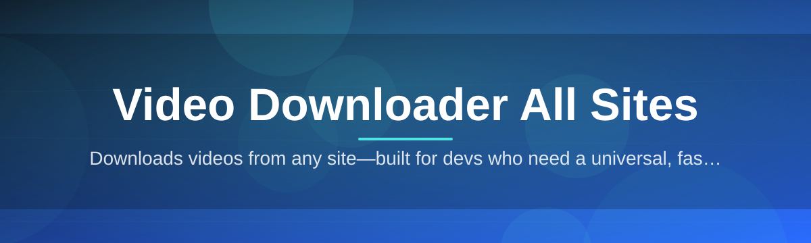

# vid-dl-allsites-tool 🎬⬇️

  

*One tool, every site, your videos — saved locally in the format you actually want.*

  

---

## 🧭 Overview

**What this is NOT:** it's not a browser extension that breaks every time a site updates its DOM, not a sketchy "convert now" website plastered with pop-ups, and not a paid subscription service holding your downloads hostage behind a paywall. It also isn't a bloated media suite trying to be a video editor, a converter, a torrent client, and a media server all at once. If you've been burned by tools like that, you already know why this project exists.

**What it actually is:** `vid-dl-allsites-tool` is a focused, standalone Windows application built around one job — pulling video and audio streams from just about any site that serves media, and saving them to your disk in a clean, predictable way. Paste a link, pick a quality, hit download. That's the whole interaction model. Under the hood it handles playlist expansion, subtitle tracks, thumbnail embedding, and format remuxing, but none of that complexity leaks into the UI unless you go looking for it.

This project exists because the "video downloader all sites" space is crowded with tools that are either abandoned, ad-riddled, or overly technical CLI wrappers with no interface at all. We wanted something a non-technical relative could use, but that a power user could still script around. Whether you're archiving lecture series, saving your own uploaded content for backup, or building a personal offline media library, this tool is built for the person who just wants their video, downloaded, without ceremony.

  

---

## 🔥 What Makes It Tick

- **Universal link parsing** — drop in a URL from nearly any streaming or hosting page and the tool identifies the correct extraction path automatically, no need to pick a "site profile" manually.

- **Batch queueing** — paste ten, twenty, or a hundred links at once; the queue processes them sequentially or in parallel depending on your bandwidth settings.

- **Smart quality ladder** — the resolution picker shows only what's actually available for that specific video, so you're never guessing between a 4K option that doesn't exist and a 240p fallback.

- **Subtitle & caption capture** — grabs available subtitle tracks alongside the video and can burn them in or keep them as separate `.srt` files.

- **Audio-only extraction** — strip video entirely and save just the audio track, useful for podcasts, lectures, or music sets.

- **Resumable transfers** — if your connection drops mid-download, the tool picks up where it left off instead of restarting from zero.

- **Playlist & channel expansion** — feed it a playlist or channel link and it unpacks the full list of videos into the queue for review before anything downloads.

- **Local history log** — every completed download is logged with timestamp, source, and file path so you can find things later without digging through folders.

> [!TIP]
> Hover over any queued item before it starts downloading — a quick preview panel shows duration, estimated file size, and available formats so you're not downloading blind.

---

## 🚀 How to Get Started

1. Visit the project landing page using the **Get Started** button below (or above) — this is the only place we distribute the tool.

2. Download the latest build for Windows from the landing page.

3. Run the executable — there's no installer wizard, no admin prompts, and no background services left running after you close it.

4. Paste a video link into the input field, choose your quality/format, and click **Download**.

> [!NOTE]
> The tool is portable. You can run it from a USB drive or a synced folder without a traditional install step.

  

---

## 🖥️ System Requirements

| Component | Minimum | Recommended |
|---|---|---|
| **OS** | Windows 10 (64-bit) | Windows 11 (64-bit) |
| **RAM** | 2 GB | 4 GB or more |
| **Disk Space** | 150 MB free (app only) | 5 GB+ free (for downloaded media) |

> [!IMPORTANT]
> No external dependencies, runtimes, or frameworks need to be installed separately — everything the tool needs ships in the standalone package.

  

---

## ⚙️ How It Works

The pipeline behind every download follows the same predictable path, regardless of which site the link came from:

1. **Link submission** — you paste a URL into the app.

2. **Site detection** — the tool inspects the link structure and picks the correct extraction logic.

3. **Stream resolution** — available video/audio streams and qualities are fetched and listed.

4. **Format assembly** — video, audio, and optional subtitle streams are merged into the final container.

5. **Local save** — the finished file lands in your chosen output folder, logged in history.

<strong>Curious about format assembly specifically?</strong>

Most sites serve video and audio as separate streams for adaptive bitrate playback. The tool fetches both, verifies they align in duration, and remuxes them into a single `.mp4` or `.mkv` container — no re-encoding unless you explicitly request a format conversion, which keeps quality loss to a minimum.

---

## 🛟 Troubleshooting

**Q: The download stalls at 99% and never finishes.**
A: This usually means the final remux step is verifying stream integrity on a large file. Give it a few extra seconds — forcing a close mid-remux can corrupt the output.

**Q: A specific site isn't detected correctly.**
A: Site layouts change over time. Check the Issues tab to see if it's already reported, and if not, open a new one with the link pattern (not the actual private content link).

**Q: My antivirus is flagging the executable.**
A: This is a common false positive for unsigned portable executables that write files to disk. Verify the download hash against the value posted on the landing page before running it.

**Q: Subtitles downloaded but didn't burn into the video.**
A: Check your output settings — subtitle burn-in is opt-in and off by default so you get clean video files with separate `.srt` tracks unless you toggle it.

**Q: Can I download an entire channel at once?**
A: Yes — paste the channel URL and the tool will expand it into individual queue items you can review before committing to the batch.

---

## 🎨 UI / UX Details

> [!TIP]
> Press `Ctrl+V` anywhere in the main window to paste a link directly into the queue — you don't need to click the input field first.

**Keyboard shortcuts:**

- `Ctrl+V` — paste link into queue
- `Ctrl+Enter` — start all queued downloads
- `Ctrl+Shift+X` — clear the entire queue
- `Ctrl+,` — open settings panel
- `F5` — refresh stream metadata for selected item

**Themes:** Light, Dark, and an automatic mode that follows your Windows system theme setting.

**Settings worth knowing about:**

- Default output folder and filename template
- Bandwidth throttling for background downloads
- Auto-clear completed items after a set time
- Notification toggle for download completion

---

## 🤝 Contributing & Community

We actively welcome first-time contributors. The codebase is organized so that new site-support modules can be added without touching the core download engine.

> [!NOTE]
> Look for issues tagged `good first issue` — these are scoped specifically to be approachable without deep familiarity with the whole project.

- Found a bug? Open an issue with reproduction steps.
- Want a new site supported? Open a feature request describing the site's video structure.
- Improving docs, translations, or UI polish is just as valuable as core engine work — all contributions get reviewed with the same care.

> [!WARNING]
> Please don't submit pull requests that add support for downloading content in ways that violate a platform's terms of service for copyrighted or paywalled material. This tool is meant for content you have the right to save.

---

## 📄 License

Released under the [MIT License](LICENSE), 2026. Use it, fork it, build on it — just keep the license notice intact.

---

## ⚠️ Disclaimer

This tool is provided for personal, educational, and archival use with content you own or have explicit permission to download. Respect the terms of service of any platform you use it with, and applicable copyright law in your jurisdiction. The maintainers of `vid-dl-allsites-tool` are not responsible for how the tool is used by third parties.

  

